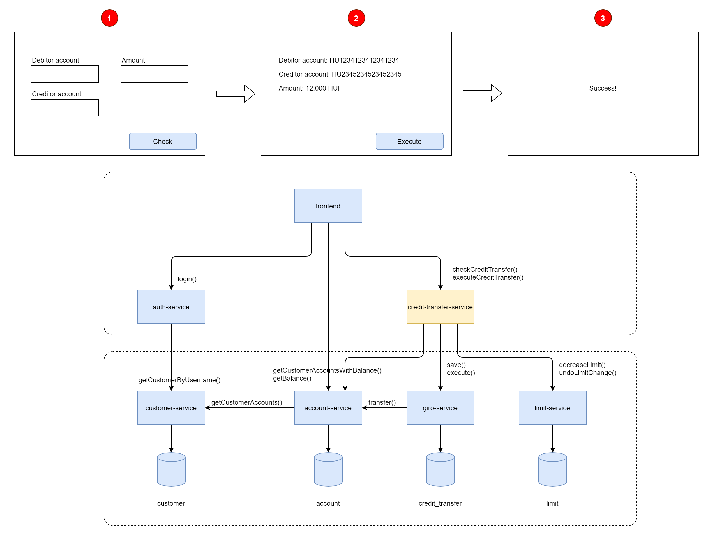

# Micro Orchestrator

This project shows a possible implementation of a simple orchestrator. Let's say we have the below architecture of a credit transfer solution. The problem is within the `credit-transfer-service`.

Whenever the frontend instructs the `credit-transfer-service` to execute the credit transfer it checks if the account balance covers the amount of the transaction, if yes, it decreases the daily limit by using the `limit-service`. Then it calls the execute() endpoint of the `giro-service`. Now the `giro-service` and the `limit-service` are independent microservices. In case the `giro-service` returns an error, all the previous actions have to be undone. For this we have the well-known SAGA pattern and Camunda as an orchestrator.

But Camunda is not free, and makes the processing pretty complicated. Can this be made easier? Let's see.


## First attempt
```
public ExecuteCreditTransferResponse executeCreditTransfer(ExecuteCreditTransferRequest executeRequest) throws CreditTransferException, ResourceNotFoundException
{
    AuthenticatedUser authenticatedUser = this.authorizationService.getAuthenticatedUser();

    if (!this.creditTransferMap.containsKey(executeRequest.getTransactionHash()))
    {
        // Transaction not found
        throw new CreditTransferException(MessageFormat.format("Transaction {0} not found!", executeRequest.getTransactionHash()));
    }
    CreditTransferCacheData creditTransferCacheData = this.creditTransferMap.get(executeRequest.getTransactionHash());

    // Check if same user executes
    if (!LongUtils.equals(creditTransferCacheData.getUserId(), authenticatedUser.getUserId()))
    {
        throw new CreditTransferException("User does not have right to execute this transaction!");
    }

    // Decrease limit
    if (!this.limitService.decreaseLimit(authenticatedUser.getUserId(), creditTransferCacheData.getAmount()))
    {
        throw new CreditTransferException("Daily limit is exceeded!");
    }

    // Execute credit transfer
    try
    {
        this.giroService.execute(creditTransferCacheData.getGiroId());
    }
    catch (RuntimeException | CreditTransferException | ResourceNotFoundException e)
    {
        // This is the corrective action after an exception has been thrown
        this.limitService.increaseLimit(authenticatedUser.getUserId(), creditTransferCacheData.getAmount());
        throw e;
    }

    return new ExecuteCreditTransferResponse(ZonedDateTime.now());
}
```
## Using MicroOrchestrator
```
public ExecuteCreditTransferResponse executeCreditTransfer(ExecuteCreditTransferRequest executeRequest) throws Exception
{
    AuthenticatedUser authenticatedUser = this.authorizationService.getAuthenticatedUser();

    if (!this.creditTransferMap.containsKey(executeRequest.getTransactionHash()))
    {
        // Transaction not found
        throw new CreditTransferException(MessageFormat.format("Transaction {0} not found!", executeRequest.getTransactionHash()));
    }
    CreditTransferCacheData creditTransferCacheData = this.creditTransferMap.get(executeRequest.getTransactionHash());

    // Check if same user executes
    if (!LongUtils.equals(creditTransferCacheData.getUserId(), authenticatedUser.getUserId()))
    {
        throw new CreditTransferException("User does not have right to execute this transaction!");
    }

    MicroOrchestrator orchestrator = new MicroOrchestrator();

    // Changing limit
    orchestrator.addStep(new ProcessStep("Changing limit")
            .action(() -> {
                if (!this.limitService.decreaseLimit(authenticatedUser.getUserId(), creditTransferCacheData.getAmount()))
                {
                    throw new CreditTransferException("Daily limit is exceeded!");
                }
            })
            .undoAction(() -> {
                // This is the corrective action after an exception has been thrown
                this.limitService.increaseLimit(authenticatedUser.getUserId(), creditTransferCacheData.getAmount());
            }));

    // Execute credit transfer
    orchestrator.addStep(new ProcessStep("Executing credit transfer")
            .action(() -> this.giroService.execute(creditTransferCacheData.getGiroId())));

    orchestrator.execute();

    return new ExecuteCreditTransferResponse(ZonedDateTime.now());
}
```
